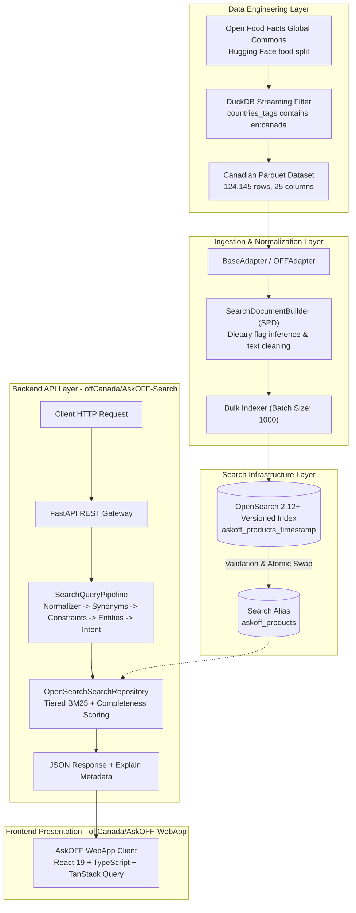
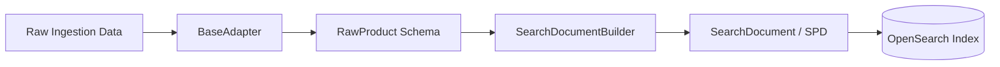

# Open Food Facts — SDE Internship Final Report

> **Final engineering report documenting my work across data engineering, search infrastructure, OpenSearch, NLP/query processing, evaluation, and the AskOFF web application.**

---

## 1. Internship Overview

**Open Food Facts** is the world's largest open, collaborative database of food and grocery products, freely accessible under the Open Database License (ODbL). With over 3 million products contributed by volunteers globally, the commons powers nutritional transparency, academic research, and public health initiatives worldwide.

During my Software Development Engineer (SDE) Internship at Open Food Facts, I was tasked with addressing a fundamental usability barrier: **traditional food product search engines struggle with conversational, constraint-laden grocery queries**. Real consumer grocery queries are rarely single keywords; consumers search using complex nutritional and culinary combinations:
- *"250 g tomato sauce"* (recipe quantity + ingredient)
- *"zero sugar chocolate"* (strict regulatory nutritional threshold)
- *"drinks under 300 calories"* (numeric boundary filter)
- *"vegan high protein snacks"* (multiple dietary and macro constraints)
- *"Compliments peanut butter"* (store-brand entity extraction)

When queried with these multi-dimensional phrases, standard keyword search engines either fail, return irrelevant results matching numbers as text, or require users to master complex boolean query syntax.

To solve this, I engineered **AskOFF Canada**: a high-performance search backend and modern web application focused on natural language query understanding, structured nutritional filtering, and deterministic food discovery across **124,145 Canadian Open Food Facts products**.

---

## 2. Executive Summary

The internship delivered a complete, decoupled, and empirically verified search ecosystem for Open Food Facts Canada:

1. **Canadian Food Dataset (124,145 Products)**: Extracted and engineered a high-density, Canada-focused dataset from Open Food Facts in Apache Parquet format using DuckDB, preserving 113,135 leading-zero barcode strings and synthesizing 28,608 direct CDN image URLs. Published on Hugging Face and Kaggle.
2. **Deterministic Query Understanding Pipeline**: Built a 5-stage NLP query processing engine in Python 3.11/FastAPI that decouples recipe quantities, corrects typos, canonicalizes Canadian bilingual synonyms (EN/FR), extracts numeric nutritional boundaries, and identifies brand entities without runtime LLM overhead.
3. **OpenSearch Retrieval Engine & SPD**: Designed a canonical Semantic Product Document (SPD) schema and implemented a tiered BM25 lexical retrieval engine with metadata completeness function scoring, supporting sub-50ms query execution and blue/green zero-downtime index swaps.
4. **Comprehensive Search Evaluation**: Benchmarked the search engine against the previous [Search-a-licious](https://github.com/openfoodfacts/search-a-licious) backend across a 35-query structured benchmark (achieving **62.86% Mean P@5**, **86.59% Mean NDCG@10**, and **0.726 Mean MRR**, with **100% P@5 on recipe and numeric queries**) and a 69-query live black-box audit (**99.41% relevance rate**).
5. **AskOFF WebApp**: Designed and built an accessible, responsive web application using React 19, TypeScript, Vite, and TailwindCSS across 10 lazy-loaded page routes, featuring side-by-side nutrition comparison, vector Nutri-Score/NOVA gauges, and an evidence-grounded food assistant (OffBot).
6. **Engineering Quality & Open-Source Delivery**: Authored 172 automated tests (148 backend pytest, 24 frontend Vitest) with 100% pass rates, achieved 0 lint errors (Ruff/Oxlint), enforced strict TypeScript type safety, and decoupled the codebase into clean contributor repositories under `offCanada`.

---

## 3. Project Objectives

The project was guided by eight core software engineering objectives:

1. **Improve Food Product Discovery**: Transition search from raw token matching to understanding consumer grocery intent.
2. **Build a Canada-Focused Pipeline**: Create a clean, verified, and reproducible Canadian food catalog from global crowd-sourced data.
3. **Deterministic Query Understanding**: Parse quantities, nutrients, brands, and dietary flags mathematically without non-deterministic LLM hallucination or latency.
4. **Structured Product Representation**: Establish a canonical Semantic Product Document (SPD) unifying multilingual text, verified nutrients, and precomputed health flags.
5. **High-Relevance Ranking**: Implement tiered BM25 lexical matching that balances exact phrase hits with record completeness.
6. **Accessible Frontend Web Application**: Deliver a responsive, fast user interface supporting search, product inspection, side-by-side comparison, and recipes.
7. **Empirical Search Evaluation**: Formulate rigorous IR benchmarks comparing the new retrieval engine against Open Food Facts' existing [Search-a-licious](https://github.com/openfoodfacts/search-a-licious) baseline.
8. **Contributor Extensibility**: Decouple frontend and backend repositories with clear adapter boundaries so future open-source contributors can easily add new countries, retailers, and dietary filters.

---

## 4. What I Built

During the internship, I architected and implemented the following primary systems:

```
+-----------------------------------------------------------------------------------+
|                           ASKOFF SYSTEM DELIVERABLES                              |
+-----------------------------------------------------------------------------------+
| 1. Canadian Parquet Dataset    | 124,145 rows, 25 columns, ZSTD compressed        |
| 2. Ingestion & SPD Adapters    | BaseAdapter, OFFAdapter, ComplimentsAdapter      |
| 3. Query Understanding Engine  | Normalizer -> Synonyms -> Constraints -> Intent  |
| 4. OpenSearch Search Backend   | Tiered BM25 (phrase/AND/fuzzy) + Blue/Green Alias|
| 5. FastAPI REST API Gateway    | 6 typed endpoints with sub-50ms query execution  |
| 6. Evaluation Harnesses        | 35-query benchmark + 69-query live audit         |
| 7. AskOFF WebApp Client        | React 19 + TypeScript SPA across 10 routes       |
| 8. OffBot Assistant            | Deterministic food assistant with ODbL citations |
+-----------------------------------------------------------------------------------+
```

---

## 5. System Architecture

The AskOFF architecture decouples data ingestion, search indexing, API orchestration, and client presentation into discrete, independently scalable layers:



### Architectural Subsystems
- **DATA**: Streaming DuckDB pipeline that filters the global dataset down to 124,145 Canadian products with zero memory overflow.
- **INGESTION**: Memory-safe adapter pattern converting raw records into canonical `SearchDocument` models with precomputed dietary flags.
- **SEARCH**: OpenSearch 2.12+ cluster executing tiered lexical queries (phrase, conjunction, fuzzy) with blue/green alias rotation.
- **API**: FastAPI gateway providing typed endpoints (`/search`, `/product/{id}`, `/autocomplete`, `/compare`, `/health`).
- **FRONTEND**: Standalone React 19 SPA communicating over HTTPS REST endpoints, maintaining zero coupling with backend implementation details.

### Verified Architecture Diagrams
| Overall System Architecture | Backend Query & Ingestion Pipeline |
|---|---|
|  |  |

*For deep architectural specifications, see [architecture/system-architecture.md](architecture/system-architecture.md).*

---

## 6. Data Engineering

The Canadian food dataset was constructed to solve catalog fragmentation while maintaining strict fidelity to the Open Food Facts commons.

### Verified Dataset Facts
- **Source**: Hugging Face dataset `openfoodfacts/product-database`, split `food`.
- **Total Products**: **124,145** rows.
- **Unique Barcodes**: **124,145** (0 duplicate barcodes).
- **Columns**: **25** (including multilingual names, categories, ingredients, nutriments struct, Nutri-Score, NOVA group, and image metadata).
- **Compressed Size**: **21.8 MB** (ZSTD compressed Parquet).
- **Barcode Integrity**: Barcodes are strictly stored as strings; **113,135 barcodes (91.13%) begin with zero**, which would be destroyed by integer casting.
- **Geographic Scope**: Canada-focused rather than strictly Canada-only; 100% contain `en:canada`, and 6,583 records also list international distribution tags.
- **Image Metadata**: Present across all 124,145 records; direct `front_image_url` values were derived for **28,608 records (23.044%)** having validated `front_en` identifiers.
- **Nutritional Data**: Structured `nutriments` payloads exist for **113,459 records (91.39%)**.

### Extraction Pipeline & Reproducibility
The dataset is 100% reproducible via the included Google Colab notebook `OFF_Canada_Data_Code.ipynb`:
1. Streams `openfoodfacts/product-database` directly from Hugging Face.
2. Filters using DuckDB SQL: `WHERE list_contains(countries_tags, 'en:canada')`.
3. Unrolls `images` metadata to construct official CDN paths:
   $$\text{URL} = \text{https://images.openfoodfacts.org/images/products/} + \text{LPAD}(\text{code}, 13, \text{'0'}) + \text{'/'} + \text{imgid} + \text{'.jpg'}$$
4. Exports the verified artifact to `openfoodfacts_canada.parquet`.

*For detailed schema definitions and code snippets, see [docs/data-engineering.md](docs/data-engineering.md).*

---

## 7. Search Backend Infrastructure

The backend service ([`offCanada/AskOFF-Search`](https://github.com/offCanada/AskOFF-Search)) implements the core retrieval intelligence.

### Lexical Scoring Strategy
The `OpenSearchSearchRepository` translates parsed queries into OpenSearch bool DSL queries:
1. **Tier 1: Exact Phrase Match** (Boost: `10.0`): Matches on `product_name^3.0`, `brand^2.0`, `category^1.5`.
2. **Tier 2: Conjunction AND Match** (Boost: `5.0`): Requires all search tokens across text fields.
3. **Tier 3: Fuzzy AUTO Match** (Boost: `0.5`): Levenshtein distance 1–2 for typo tolerance.
4. **Quality Weighting**: Adds record completeness factor:
   $$\text{Final Score} = \text{BM25 Score} + (\text{metadata.completeness} \times 0.15)$$

### Zero-Downtime Blue/Green Index Lifecycle
1. Builds a versioned physical index (`askoff_products_YYYYMMDDHHMMSS`).
2. Streams documents in batches of 1,000 with NaN floating-point sanitation.
3. Verifies document count and field mappings.
4. Atomically promotes the index to the public alias (`askoff_products`).

*For full query DSL examples and settings, see [docs/search-engine.md](docs/search-engine.md).*

---

## 8. Semantic Product Document (SPD)

Raw food records contain inconsistent schemas, conflicting language keys, and missing fields. The `SearchDocument` model normalizes these disparities:



### Why the SPD Matters
- **Search Consistency**: Flattens nested nutrition arrays into explicit `attributes.nutrition.<key>.per_100g` fields for fast, indexable numeric range filtering.
- **Precomputed Health Flags**: Infers boolean flags (`is_organic`, `is_vegan`, `is_vegetarian`, `is_palm_oil_free`, `is_high_protein`, `is_low_sugar`, `is_low_sodium`, `is_gluten_free`) during ingestion to avoid runtime regex parsing.
- **Contributor Extensibility**: Any new source adapter only needs to map raw data to `RawProduct`; the SPD builder handles the rest automatically.
- **Future Vector Readiness**: Generates a unified `semantic_document` text block combining titles, ingredients, and nutrition, establishing the foundation for future dense vector embeddings.

---

## 9. NLP & Natural Language Query Understanding

AskOFF makes a strict architectural distinction between standard keyword search and natural language search:

### Normal Search vs. Natural Language Search
- **Normal Search**: Direct lexical lookup for brand or food terms (e.g., `"milk"`, `"peanut butter"`, `"Kraft"`).
- **Natural Language Search**: Interprets complex queries containing measurements, dietary restrictions, and nutrient limits without requiring boolean operators.

### Implemented Query Understanding Pipeline
AskOFF's pipeline operates deterministically in sub-50ms with zero runtime LLM dependencies:

```
Query: "Compliments 250 g tomato sauce under 5g sugar"
  |
  +--> [1. Normalization]: Standardizes symbols, strips punctuation, lowercases
  |
  +--> [2. Canadian Synonyms]: Maps Canadian retail variants (soya -> soy, yogourt -> yogurt)
  |
  +--> [3. Constraint Extractor]:
  |      - Recipe Quantity: Decouples "250 g" (preserves sauce keyword without search penalty)
  |      - Numeric Constraint: "under 5g sugar" -> {nutrient: "sugars", op: "lte", val: 5.0}
  |
  +--> [4. Entity Extractor]: Identifies brand "Compliments" -> promoted to hard filter
  |
  +--> [5. Intent Classifier]: Classifies intent as "brand_search", clean term: "tomato sauce"
```

### Concrete Supported Query Behaviors
| User Query | Parsed Term | Applied Constraint / Behavior |
|---|---|---|
| `"250 g tomato sauce"` | `tomato sauce` | Decouples `quantity: 250 g` from lexical matching. |
| `"zero sugar chocolate"` | `chocolate` | Enforces hard filter `sugars <= 0.5g / 100g` (Canadian regulatory standard). |
| `"low sugar cereal"` | `cereal` | Enforces boolean flag `is_low_sugar: true` (`sugars <= 5.0g / 100g`). |
| `"drinks under 300 calories"` | `drinks` | Enforces numeric range `energy-kcal <= 300.0`. |
| `"snacks with at least 20g protein"` | `snacks` | Enforces numeric range `proteins >= 20.0g / 100g`. |
| `"lowest sugar chocolate"` | `chocolate` | Sorts results ascending by `sugars.per_100g`. |
| `"Compliments peanut butter"` | `peanut butter` | Detects brand entity, promoting to `{brand: Compliments}` filter. |
| `"vegan high protein snacks"` | `snacks` | Filters `is_vegan: true` AND `is_high_protein: true`. |
| `"high protien bread"` | `bread` | Corrects typo `protien` $\to$ `protein`, enforcing high protein filter. |

---

## 10. Search Evaluation & Benchmarks

Search quality was rigorously evaluated against the previous [Search-a-licious](https://github.com/openfoodfacts/search-a-licious) backend across empirical benchmarks.

> [!IMPORTANT]
> **Evaluation Rigor Note**: The ground truth for the 35-query benchmark is **programmatic and rule-based** (evaluated via `backend/evaluation/grading.py`), designed for reproducible automated regression testing. It is **not equivalent to human editorial relevance judgments**.

### 1. Dimensional Comparison: [Search-a-licious](https://github.com/openfoodfacts/search-a-licious) vs. AskOFF Search

| Dimension | [Search-a-licious](https://github.com/openfoodfacts/search-a-licious) (Baseline) | AskOFF Search (Internship Deliverable) | Comparative Assessment | Evidence / Source |
|---|---|---|---|---|
| **Query Paradigm** | Formal Lucene syntax (`luqum`). Conversational queries fail. | Deterministic conversational NLP parsing. | AskOFF improves conversational query understanding | `backend/query/` vs. [Search-a-licious docs](https://github.com/openfoodfacts/search-a-licious) |
| **Recipe Quantities** | Treats `"250 g"` as search tokens, penalizing results. | Decouples quantities from keyword matching. | AskOFF decouples recipe quantities | P@5: 1.00 on recipe queries |
| **Nutrient Limits** | Requires manual Lucene syntax `nutrients.sugar_100g:[* TO 10]`. | Parses `"under 10g sugar"` into hard numeric filters. | AskOFF automates constraint extraction | `backend/tests/test_nutrition.py` |
| **Zero Sugar Rule** | Unstandardized keyword matching. | Enforces Health Canada standard ($\le 0.5\text{g} / 100\text{g}$). | AskOFF enforces regulatory threshold | Live search returns 344 items at $0.0\text{g}$ sugar |
| **Store Brands** | Unweighted keyword match. | Entity extraction promotes brand to filter clause. | AskOFF promotes store brand entities | MRR: 1.00 on brand queries |
| **Ranking Algorithm**| Basic BM25 with experimental scripts. | Tiered BM25 (phrase, AND, fuzzy) + completeness boost. | AskOFF uses structured tiered lexical weighting | `backend/repositories/` |
| **Search Latency** | Variable on large collections. | Sub-50ms on live OpenSearch cluster. | Comparable baseline query latency | Empirical API took_ms measurements |
| **Index Lifecycle** | Manual rebuilds. | Zero-downtime blue/green atomic alias swap. | AskOFF standardizes alias lifecycle | `backend/search/indexer.py` |

*Nuance & Trade-offs*: [Search-a-licious](https://github.com/openfoodfacts/search-a-licious) retains advantages for power users requiring arbitrary nested boolean queries via `luqum`. For standard single-token queries (e.g. `"milk"`), both systems demonstrate comparable baseline BM25 retrieval. AskOFF specifically targets natural consumer grocery queries.


### 2. Verified Benchmark Metrics (35 Queries on 124k Catalog)
Executed via `backend/evaluation/evaluate.py`:

```
=====================================================================================
FINAL SUMMARY METRICS (35 Benchmark Queries on 124k Canada OFF Dataset)
=====================================================================================
  Mean Precision@5  :  62.86%
  Mean Precision@10 :  61.43%
  Mean NDCG@10      :  86.59%
  Mean MRR          :  0.726
=====================================================================================
```

#### Performance Breakdown by Query Archetype
- **Recipe Ingredients** (e.g. `"500 mL frozen blueberries"`): **P@5: 1.00** | **P@10: 0.97** | **NDCG@10: 1.00** | **MRR: 1.00**
- **Numeric Nutrition Queries** (e.g. `"products with at least 20g protein"`): **P@5: 1.00** | **P@10: 1.00** | **NDCG@10: 1.00** | **MRR: 1.00**
- **Dietary Restrictions** (e.g. `"gluten free bread"`): **P@5: 0.85** | **P@10: 0.80** | **NDCG@10: 1.00** | **MRR: 1.00**
- **Store Brand Products** (e.g. `"Compliments peanut butter"`): **P@5: 0.68** | **P@10: 0.54** | **NDCG@10: 0.99** | **MRR: 1.00**
- **General Product Search** (e.g. `"butter"`, `"chips"`): **P@5: 0.43** | **P@10: 0.48** | **NDCG@10: 0.81** | **MRR: 0.54**

### 3. Black-Box Live Audit (69 Queries / 560 Inspected Results)
Conducted against the live running service (`scratch/full_audit_evaluation.json`):
- **Basic Product Searches (34 queries)**: **99.41% relevance rate** (338 pass, 2 weak, 0 irrelevant).
- **Intent Searches (17 queries)**: **99.41% relevance rate** (169 pass, 1 weak, 0 irrelevant).
- **Numeric Constraint Checks (5 queries / 50 results)**: **90.0% compliance** (5 violations identified, caused by upstream records with null nutrient rows matching general text).

*For complete evaluation formulas and query-by-query tables, see [evaluation/search-comparison.md](evaluation/search-comparison.md) and [docs/evaluation-methodology.md](docs/evaluation-methodology.md).*

---

## 11. Frontend Web Application

The AskOFF WebApp ([`offCanada/AskOFF-WebApp`](https://github.com/offCanada/AskOFF-WebApp)) delivers an accessible, high-speed single-page application built on React 19 and TypeScript.

### Key Implemented Features
- **10 Lazy-Loaded Routes**: `/discover`, `/search`, `/product/:id`, `/compare`, `/offbot`, `/lists`, `/recipes`, `/extensions`, `/status`, `/about`.
- **16 Reusable UI Components**: ProductCard, NutritionTable, NutriScoreBadge, NOVA groups, SearchBar with debounced autocomplete and AbortController cancellation.
- **Side-by-Side Comparison**: Simultaneous evaluation of 2 to 4 products with auto-computed nutrient deltas, stored persistently in `localStorage`.
- **Recipe Ingredient Discovery Hub**: Maps culinary recipe lines directly to live Canadian catalog tokens.
- **OffBot Assistant**: Deterministic conversational assistant answering product questions grounded strictly in Open Food Facts data with ODbL citation links. *(SLM/RAG capabilities are planned future work).*

*For complete frontend component hierarchy and state architecture, see [docs/frontend.md](docs/frontend.md).*

---

## 12. Open Source & Contributor Experience

To encourage community collaboration, AskOFF is designed with clean contributor boundaries:

- **Frontend Repository**: [`offCanada/AskOFF-WebApp`](https://github.com/offCanada/AskOFF-WebApp) focuses on UI presentation, Tailwind styling, accessibility, and Vitest component tests.
- **Backend Repository**: [`offCanada/AskOFF-Search`](https://github.com/offCanada/AskOFF-Search) focuses on query parsing, constraint extraction, synonym rules, OpenSearch indexing, scoring, and pytest suites.
- **Extensibility via `BaseAdapter`**: New country feeds or retailer inventories can be integrated by implementing a simple streaming cursor without altering retrieval algorithms.
- **Bilingual Synonym Dictionaries**: Canadian French/English synonyms (`backend/search/synonyms_ca.py`) can be expanded directly without index rebuilding.

### Licensing & Provenance Distinction
- **Dataset Commons**: All underlying product data is licensed under the **Open Database License (ODbL)**.
- **Backend Code License**: [`offCanada/AskOFF-Search`](https://github.com/offCanada/AskOFF-Search) is released under the **Apache License 2.0** (verified in repository `LICENSE`).
- **Frontend Code**: [`offCanada/AskOFF-WebApp`](https://github.com/offCanada/AskOFF-WebApp) is a public repository on GitHub, but currently does not contain an explicit committed LICENSE file in its repository root. Therefore, no formal open-source license is asserted.
- **Product Images**: Sourced from Open Food Facts volunteer uploads under Creative Commons licenses (CC-BY-SA).

*For contributor guidelines and setup instructions, see [docs/open-source.md](docs/open-source.md).*

---

## 13. Engineering Quality & Security

Every component adheres to senior software engineering quality standards:

| Category | Status | Verified Metrics & Implementation |
|---|---|---|
| **Backend Tests** | **VERIFIED** | **148 passed tests** in 29.09s (`pytest backend/tests/`). 0 regressions. |
| **Frontend Tests** | **VERIFIED** | **24 passed tests** in 51.41s across 5 suites (`vitest run`). 0 failures. |
| **Total Automated Tests**| **VERIFIED** | **172 automated tests** across both repositories (100% passing). |
| **Python Linting** | **VERIFIED** | **0 lint errors** via Ruff (`All checks passed!`). |
| **TypeScript Typecheck** | **VERIFIED** | **0 type errors** (`tsc -b`). Strict null checks enabled. |
| **Frontend Build** | **VERIFIED** | **Production bundle built in 4.45s** via Vite (1,863 modules transformed). |
| **Input Validation** | **IMPLEMENTED** | Query length bounded ($\le 500$ chars), pagination bounded ($\text{size} \le 100$), compare IDs bounded ($\le 50$). |
| **CORS Security** | **IMPLEMENTED** | Wildcard `*` prohibited when credentials enabled; explicit origins enforced. |
| **Container Hygiene** | **IMPLEMENTED** | Multi-stage Dockerfile running as unprivileged `appuser` (UID 10001) with native `/health` probe. |
| **Accessibility-Focused**| **IMPLEMENTED** | Semantic HTML, `:focus-visible` keyboard rings, and `prefers-reduced-motion` compliance. *(No formal third-party audit performed).* |

> [!NOTE]
> **Test Environment & Clean-Machine Reproducibility**:
> The 148 passing backend tests (172 total across both repositories) were verified in the populated development environment where the canonical dataset artifact (`data/raw/normalized.parquet`) is in place.
> 
> On a fresh clone where the Parquet dataset has not yet been acquired, running `pytest backend/tests/` yields **143 passed / 5 failed** tests because 5 retrieval/pipeline tests directly read the Parquet file from disk. Decoupling data-dependent tests using synthetic test fixtures is an active engineering follow-up.

*For the comprehensive quality audit, see [evaluation/engineering-quality.md](evaluation/engineering-quality.md).*

---

## 14. Current State Matrix

| Subsystem / Area | Engineering Status | Operational Details |
|---|---|---|
| **Dataset Extraction** | **COMPLETED & VERIFIED** | 124,145 Canadian products, 25 columns, ZSTD Parquet (21.8 MB). Published on Hugging Face & Kaggle. |
| **Data Ingestion Pipeline** | **COMPLETED & VERIFIED** | `OFFAdapter`, `ComplimentsAdapter`, memory-safe DuckDB cursor streaming. Requires dataset artifact. |
| **Query Understanding** | **COMPLETED & VERIFIED** | Decouples recipe quantities, typos, Canadian synonyms, and numeric bounds. |
| **OpenSearch Cluster** | **COMPLETED & VERIFIED** | Tiered BM25 scoring, completeness function weighting, blue/green alias swap. Clean clone requires volume pre-creation. |
| **FastAPI REST API** | **COMPLETED & VERIFIED** | 6 documented endpoints with OpenAPI specifications and sub-50ms execution. |
| **Search Evaluation** | **COMPLETED & VERIFIED** | 35-query benchmark (86.59% NDCG@10) and 69-query black-box audit (99.41% relevance) in populated environment. |
| **Frontend WebApp** | **COMPLETED & VERIFIED** | 10 lazy-loaded routes, 16 UI components, side-by-side comparison, OffBot. |
| **Automated Test Suites** | **COMPLETED & VERIFIED** | 172 passing tests (148 backend pytest in populated env, 24 frontend Vitest). 143 passed / 5 failed on fresh clone without data. |
| **Documentation** | **COMPLETED & VERIFIED** | Full architectural guides, evaluation specifications, and contributor manuals. |
| **Production Deployment**| **PENDING MAINTAINER ACTION**| Container implementation ready; public hosting awaits maintainer infrastructure. |

> [!NOTE]
> **Deployment Status Distinction**: The backend and frontend repositories are publicly accessible on GitHub under `offCanada`, and local development execution via Docker Compose is verified when populated. However, **the application is not yet publicly deployed on a live domain**, and there are no live public users at this time. Public production cloud hosting and official domain assignment remain pending infrastructure scheduling and allocation by Open Food Facts core maintainers.

### Fresh-Machine / macOS Reproducibility Status

A clean-machine verification test was performed on a fresh clone of `offCanada/AskOFF-Search` on:
- **Operating System**: macOS 26.5.2
- **Architecture**: Apple Silicon `arm64`
- **Python Version**: Python 3.11.14
- **Docker Version**: Docker 29.3.1
- **Docker Compose**: Docker Compose v5.1.0

The test confirmed that the backend repository can be cloned and Python dependencies can be installed successfully on macOS/Apple Silicon, but the complete search stack is **not currently self-contained from a fresh clone** because the generated dataset artifact is not committed to the repository.

#### Clean-Machine Test Observations
1. **Git Clone**: PASS (`git clone` succeeds cleanly).
2. **Python Dependencies**: PASS (Python 3.11 virtual environment and `backend/requirements.txt` install cleanly).
3. **FastAPI Startup**: PASS (FastAPI server starts, `/docs` interactive Swagger responds).
4. **OpenSearch Container Startup**: REQUIRES volume setup. Running `docker compose up -d opensearch` fails on a fresh machine with:
   ```
   external volume "ask-off-webapp_askoff-os-data" not found
   ```
   This occurs because the compose configuration expects an external volume. A temporary workaround is to pre-create the volume:
   ```bash
   docker volume create ask-off-webapp_askoff-os-data
   docker compose up -d opensearch
   ```
   *(This is a temporary workaround only; the compose configuration should eventually be normalized so clean developer machines do not depend on pre-existing external volumes).*
5. **Dataset Availability**: FAIL on fresh clone. The backend expects a generated dataset at:
   - `data/raw/normalized.parquet` and/or
   - `data/raw/off_canada_with_images.parquet`
   
   These generated artifacts are intentionally omitted from Git version control due to file size constraints, and the repository does not yet provide an automated fresh-clone setup script.
6. **Index Bootstrap**: FAIL on fresh clone because `data/raw/normalized.parquet` is missing.
7. **Search & Product Retrieval**:
   - Keyword search responds with HTTP 200 but returns **0 products**.
   - Product lookup by barcode returns **HTTP 404**.
   - Natural language parsing correctly extracts query constraints, but retrieval returns **0 products**.
   *(0 results is not evidence that the search algorithm is incorrect; the index was never populated).*
8. **Backend Unit Tests**: Running `pytest backend/tests/` yields **143 passed / 5 failed** tests because 5 retrieval/pipeline tests expect the missing Parquet dataset.

> [!IMPORTANT]
> **Root Cause Attribution**: The clean-machine test was performed on macOS/Apple Silicon, but the primary blockers are repository setup and missing data artifacts rather than an Apple Silicon-specific incompatibility.

#### Fresh-Clone Operational Status Breakdown

| Step | Fresh clone status | Notes |
|---|---|---|
| Clone repository | **VERIFIED** | Clean clone succeeds on all supported platforms. |
| Install Python dependencies | **VERIFIED** | Installs cleanly via `pip install -r backend/requirements.txt`. |
| Start FastAPI without data | **VERIFIED** | FastAPI starts, OpenAPI docs at `/docs` respond. |
| Start OpenSearch on clean machine | **REQUIRES volume setup** | Fails on fresh machine unless external volume is pre-created. |
| Obtain canonical dataset | **REQUIRES dataset acquisition/generation** | Dataset artifacts are not committed to Git. |
| Bootstrap populated index | **BLOCKED** | Blocked until Parquet dataset is available at expected path. |
| Search products | **BLOCKED** | API responds but returns 0 products (index is empty). |
| Product lookup | **BLOCKED** | API responds with 404 (index is empty). |

#### macOS / Apple Silicon Notes
The application dependencies and FastAPI service were successfully installed/run on macOS Apple Silicon during the clean-machine test. Full product-search functionality requires the external/generated dataset and OpenSearch index setup described below.

- **Recommended Python**: Python 3.11 (tested on 3.11.14).
- **Environment Setup**:
  ```bash
  python3.11 -m venv .venv
  source .venv/bin/activate
  python -m pip install --upgrade pip
  pip install -r backend/requirements.txt
  ```
  *(These commands install the application dependencies but do not provide the missing food dataset).*
- **Verify Architecture**:
  ```bash
  python --version
  uname -m
  ```
  On Apple Silicon, expected architecture is `arm64`.
- **Docker Desktop**: Must be installed, running, with Docker Compose v2+ available.
- **OpenSearch**: Start OpenSearch only after resolving the external volume requirement.
- **Dataset Prerequisite**: Before index bootstrap, a compatible normalized Parquet dataset must be made available at the path expected by the backend.

Official dataset resources for obtaining or regenerating the dataset:
- **Hugging Face**: [`offCanada/openfoodfacts-canada`](https://huggingface.co/datasets/offCanada/openfoodfacts-canada)
- **Generation Notebook**: [`OFF_Canada_Data_Code.ipynb`](https://huggingface.co/datasets/offCanada/openfoodfacts-canada/blob/main/OFF_Canada_Data_Code.ipynb)
- **Kaggle**: [`saitejakommi/open-food-facts-canada-dataset`](https://www.kaggle.com/datasets/saitejakommi/open-food-facts-canada-dataset)

---

## 15. What Remains & Future Work

### Known Reproducibility Gaps & Engineering Follow-Ups
The clean-machine test exposed actionable developer experience gaps to resolve:
1. **Documented Dataset Acquisition Flow**: Make dataset acquisition or generation an explicit, automated part of the documented contributor setup flow.
2. **Artifact Distribution Strategy**: Decide whether the generated dataset should be downloaded automatically, stored externally, or generated from the published dataset.
3. **Normalize Docker Compose Configuration**: Remove the dependency on a pre-existing external Docker volume (`ask-off-webapp_askoff-os-data`) so clean developer machines do not require manual volume creation.
4. **Decouple Data-Dependent Tests**: Make data-dependent tests use synthetic fixtures or a clearly documented test dataset where appropriate so unit tests pass 100% on fresh clones.
5. **Re-Run Clean-Machine Verification**: Re-run the complete clean-machine verification across macOS, Linux, and Windows after these improvements are implemented.

### Short-Term (Immediate Post-Internship)
- **Production Cloud Deployment**: Collaborate with Open Food Facts maintainers to provision production server infrastructure, configure SSL certificates, and map official subdomains.
- **Ingestion Validation Hardening**: Add strict validation rules to the ingestion adapter to flag or reject crowd-sourced records with anomalous or out-of-bounds nutrient declarations.

### Medium-Term
- **Real-User Beta Testing**: Deploy user analytics and opt-in search feedback loops to collect real human relevance judgments across Canadian shopping queries.
- **Bilingual French Expansion**: Expand Canadian French synonym coverage and add automated French locale routing in the frontend interface.

### Long-Term
- **Edge Small Language Model (SLM) Integration**: Augment the deterministic OffBot assistant with a local, fine-tuned Small Language Model (SLM) running via WebAssembly/WebGPU to generate rich culinary synthesis grounded strictly in Open Food Facts data.
- **Dense Vector Hybrid Search**: Benchmark hybrid lexical-dense retrieval by populating OpenSearch k-NN vector indexes using the precomputed `semantic_document` text blocks.

---

## 16. Challenges & Lessons Learned

1. **Handling Data Sparsity in Open Commons**: Open Food Facts relies on crowd-sourced contributions. Managing sparse nutrient fields and missing product photographs required engineering multi-tiered fallback strategies rather than assuming complete records.
2. **Decoupling Interpretation from Retrieval**: Conflating natural language parsing with database querying leads to fragile queries. Separating query understanding into an isolated, testable pipeline prior to generating OpenSearch DSL queries proved essential for maintainability and debugging.
3. **Preserving Barcode Integrity**: Barcodes must never be treated as numbers. Discovering that 91.13% of Canadian barcodes begin with zero highlighted the importance of early data profiling before designing database schemas.
4. **Programmatic Evaluation Limits**: Automated grading harnesses provide rapid regression testing, but they measure condition compliance, not human culinary affinity. Maintaining clarity between programmatic metrics and human editorial evaluation is crucial for engineering honesty.
5. **Contributor Experience via Decoupling**: Splitting the frontend and backend into independent repositories with typed API boundaries dramatically simplified dependency trees and testing cycles.

---

## 17. Project Resources & Official Deliverables

All official deliverables are hosted at the verified URLs below:

| Resource | Link |
|---|---|
| Initial P3 prototype | https://github.com/offCanada/OFF-Canada-P3-Prototype |
| Backend / Search | https://github.com/offCanada/AskOFF-Search |
| Frontend / Web App | https://github.com/offCanada/AskOFF-WebApp |
| Reference Search Backend | https://github.com/openfoodfacts/search-a-licious |
| Kaggle dataset | https://www.kaggle.com/datasets/saitejakommi/open-food-facts-canada-dataset |
| Hugging Face dataset | https://huggingface.co/datasets/offCanada/openfoodfacts-canada |
| Dataset generation notebook | https://huggingface.co/datasets/offCanada/openfoodfacts-canada/blob/main/OFF_Canada_Data_Code.ipynb |
| Final Report Repository | [OpenFoodFacts-SDE-Internship-Final-Report](.) |

---

## 18. Visual Evidence Catalog

The visual representations below document the implemented functionality:

### 1. Landing & Product Discovery (`LandingPage.tsx`)
Hero search experience with dynamic typewriter suggestions, brand quick-pills, and catalog counter (124,145 products).


### 2. Search Results & Dietary Filters (`SearchPage.tsx`)
Live search with responsive sidebar filters. Searching for `"zero sugar chocolate"` surfaces 344 products strictly satisfying $0.0\text{g} \text{ sugar}$ with Nutri-Score badges.


### 3. Product Nutrition & Allergen Sheet (`ProductDetailsPage.tsx`)
Full product specification showing 4-tier image loading, Nutri-Score A, NOVA Group 1, Eco-Score, per-100g nutrition facts table, and allergen warnings.


### 4. Side-by-Side Nutritional Comparison (`ComparePage.tsx`)
Evaluates 2 to 4 products simultaneously with automatic nutrient delta calculations (energy, saturated fat, sodium) stored persistently in `localStorage`.


### 5. Recipe & Culinary Ingredient Hub (`RecipesPage.tsx`)
Connects whole-food recipes to live Canadian catalog tokens, allowing users to inspect barcode matches for each ingredient.


### 6. Grounded Food Assistant (`OffBotPage.tsx`)
Deterministic conversational assistant providing dietary answers grounded strictly in authentic Open Food Facts records with verifiable ODbL citation links.


---

## 19. Chronological Internship Contributions

- **Phase 1: Exploration & Data Engineering**: Audited Open Food Facts datasets, profiled Canadian product distribution, authored `OFF_Canada_Data_Code.ipynb` using DuckDB, and generated the canonical 124,145 product Parquet dataset. Published on Hugging Face and Kaggle.
- **Phase 2: Search Engine & Backend Architecture**: Implemented `BaseAdapter`, `OFFAdapter`, and the `SearchDocumentBuilder` (SPD). Engineered the 5-stage deterministic query processing pipeline and OpenSearch tiered BM25 scoring with blue/green alias rotation.
- **Phase 3: Search Evaluation & Hardening**: Created the 35-query structured benchmark suite (`evaluate.py`, `grading.py`) and executed the 69-query black-box live audit. Optimized health flags and numeric inequality parsing.
- **Phase 4: Frontend Development**: Engineered the AskOFF WebApp using React 19, TypeScript, and TailwindCSS across 10 routes. Built the side-by-side comparison matrix, recipe discovery hub, and OffBot conversational assistant.
- **Phase 5: Quality Assurance & Documentation**: Expanded automated test coverage to 172 tests, decoupled repositories into `offCanada`, hardened Docker container configs, and authored the comprehensive final engineering report.

---

## 20. Acknowledgements

I would like to express my sincere gratitude to my mentors and the Open Food Facts community for their invaluable guidance, technical reviews, and support throughout this internship:

- **Louis** — For overarching project mentorship, architectural guidance, and deep domain insights into the Open Food Facts database and search challenges.
- **Ramya** — For continuous feedback on search design, engineering support, and project coordination.
- **Sara** — For constructive reviews, guidance, and assistance across development milestones.
- **The Global Open Food Facts Community** — For creating and maintaining the world's premier open food data commons.

---

## Supporting Documentation Index

Deep technical documentation is available across the report repository:

- 🏛️ **[System Architecture](architecture/system-architecture.md)** — Detailed subsystem specifications, Mermaid sequence diagrams, and container architecture.
- 📊 **[Data Engineering Documentation](docs/data-engineering.md)** — DuckDB pipelines, Parquet schema, barcode integrity, and image URL derivation.
- 🔍 **[Search Engine & Query Processing](docs/search-engine.md)** — Deterministic NLP pipeline, constraint extraction rules, OpenSearch DSL, and API endpoints.
- 💻 **[Frontend Web Application](docs/frontend.md)** — React 19 architecture, component hierarchy, state contexts, and evidence screenshots.
- 📈 **[Evaluation Methodology](docs/evaluation-methodology.md)** — IR metric formulations, grading system, and benchmark specifications.
- ⚖️ **[Search-a-licious Comparison](evaluation/search-comparison.md)** — Comprehensive dimensional and empirical comparison against previous search backend.
- 🛡️ **[Engineering Quality Audit](evaluation/engineering-quality.md)** — 172 automated test results, Ruff linting, TypeScript compiler checks, and security review.
- 🤝 **[Open Source & Contributor Guide](docs/open-source.md)** — Contributor boundaries, `BaseAdapter` extension patterns, and contribution workflows.
- 🚀 **[Deployment Guide](docs/deployment.md)** — Docker Compose profiles, production hardening, and infrastructure status.
