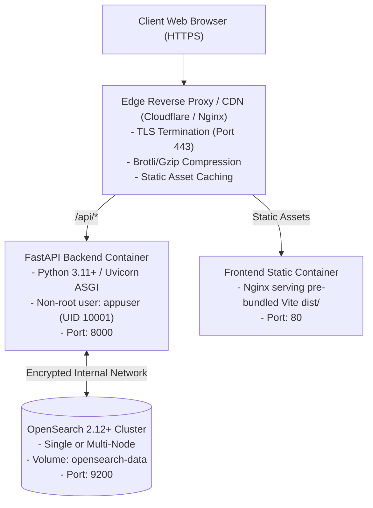

# Deployment & Infrastructure Guide — AskOFF Canada

This document details the container orchestration, runtime environments, configuration management, deployment status, and clean-machine reproducibility of the AskOFF search platform.

---

## 1. Deployment State Matrix

To ensure absolute engineering accuracy, the deployment status of AskOFF is categorized below, distinguishing clean-machine fresh-clone realities from the verified populated development environment:

| Environment / Phase | Status | Verification & Description |
|---|---|---|
| **Local Development (Clean Machine)** | **PARTIALLY REPRODUCIBLE** | FastAPI service starts, Python 3.11 dependencies install cleanly. OpenSearch requires manual Docker volume creation workaround; full search functionality is blocked until the external/generated dataset is acquired. |
| **Local Development (Populated)** | **VERIFIED / OPERATIONAL** | Verified when the dataset artifact is present and the index is populated. OpenSearch 2.12+ container running via Docker Compose, FastAPI Uvicorn server on port 8000, Vite frontend on port 5173 with `/api` proxy. |
| **Production Implementation** | **IMPLEMENTED / READY** | Fully containerized with production Dockerfile, non-root user execution (`appuser`), healthcheck probes, locked dependency trees, and Pydantic configuration validation. |
| **Public Production Deployment** | **PENDING MAINTAINER ACTION** | The service is not yet publicly hosted on a public domain. Production domain allocation and cloud infrastructure provisioning await scheduling and review by Open Food Facts core maintainers. |

### Fresh-Clone Pipeline Status Breakdown

On a clean machine starting from a fresh `git clone`, each operational layer exhibits the following verified status:

| Step | Fresh clone status | Notes |
|---|---|---|
| Clone repository | **VERIFIED** | Clean clone succeeds on all supported platforms. |
| Install Python dependencies | **VERIFIED** | Installs cleanly via `pip install -r backend/requirements.txt`. |
| Start FastAPI without data | **VERIFIED** | FastAPI starts, OpenAPI docs at `/docs` respond. |
| Start OpenSearch on clean machine | **REQUIRES volume setup** | Fails on fresh machine unless external volume is pre-created. |
| Obtain canonical dataset | **REQUIRES dataset acquisition/generation** | Dataset artifacts are not committed to Git. |
| Bootstrap populated index | **BLOCKED** | Blocked until Parquet dataset is available at expected path. |
| Search products | **BLOCKED** | API responds but returns 0 products (index is empty). |
| Product lookup | **BLOCKED** | API responds with 404 (index is empty). |

> [!NOTE]
> The application code itself starts successfully on a clean machine; the search pipeline is blocked solely because the index bootstrap requires data artifacts that are not committed to the repository.

---

## 2. Fresh-Machine / macOS Reproducibility Status

A clean-machine test was executed on a fresh clone of `offCanada/AskOFF-Search` to audit first-time contributor setup and developer experience.

### Clean-Machine Test Environment
- **Operating System**: macOS 26.5.2
- **Architecture**: Apple Silicon (`arm64`)
- **Python Version**: Python 3.11.14
- **Docker Version**: Docker 29.3.1
- **Docker Compose**: Docker Compose v5.1.0

### Verified Test Observations
1. **Git Clone**: `git clone` succeeded without issues.
2. **Python Dependencies**: Virtual environment creation and `pip install -r backend/requirements.txt` succeeded completely on Apple Silicon.
3. **FastAPI Startup**: FastAPI starts successfully; health check and documentation endpoints respond.
4. **OpenSearch Container Startup**: `docker compose up -d opensearch` failed initially because the compose file expects an external volume (`ask-off-webapp_askoff-os-data`) that does not exist on a fresh machine.
5. **Index Bootstrap**: Running index bootstrap failed because the generated dataset (`data/raw/normalized.parquet` / `data/raw/off_canada_with_images.parquet`) is not committed to the repository.
6. **Search & Product Lookup**:
   - Keyword search (`/search?q=milk`) responded with HTTP 200 but returned **0 products**.
   - Product lookup by barcode (`/product/{code}`) returned **HTTP 404**.
   - Natural language parsing correctly extracted constraints and query structure, but retrieval returned **0 products** because the underlying OpenSearch index contained 0 documents.
7. **Backend Test Suite**: Running `pytest backend/tests/` resulted in **143 passed / 5 failed** tests, because 5 retrieval/data-dependent tests expect the missing Parquet dataset.

> [!IMPORTANT]
> **Root Cause Distinction**: The clean-machine test was performed on macOS/Apple Silicon, but the primary blockers are repository setup and missing data artifacts rather than an Apple Silicon-specific incompatibility. Returning 0 search results is not evidence of an algorithmic flaw; the index was simply never populated.

---

## 3. macOS / Apple Silicon Notes

The application dependencies and FastAPI service were successfully installed and run on macOS Apple Silicon during the clean-machine test. Full product-search functionality requires the external/generated dataset and OpenSearch index setup described below.

### Setup Instructions for macOS / Apple Silicon
1. **Prerequisites**:
   - Recommended Python: **Python 3.11** (tested on 3.11.14).
   - Verify architecture:
     ```bash
     python3.11 --version
     uname -m
     ```
     On Apple Silicon machines, `uname -m` outputs `arm64`.
   - Docker Desktop must be installed, running, and configured with Docker Compose v2+.

2. **Environment & Dependency Installation**:
   ```bash
   python3.11 -m venv .venv
   source .venv/bin/activate
   python -m pip install --upgrade pip
   pip install -r backend/requirements.txt
   ```
   > [!NOTE]
   > These commands install the Python runtime dependencies, but they **do not** download or generate the missing food catalog dataset.

3. **Resolve Docker Volume Requirement**:
   See the Docker volume workaround in Section 4 before launching OpenSearch.

4. **Prepare Dataset**:
   Ensure a compatible normalized Parquet dataset exists at the expected backend path before attempting index bootstrap.

---

## 4. Container Configuration & Docker Volume Setup

### Multi-Stage Dockerfile (`Dockerfile`)
The backend Dockerfile uses a multi-stage build:
1. **Builder Stage**: Compiles and installs Python wheels into a virtual environment.
2. **Final Stage**: Copies only runtime dependencies into a minimal `python:3.11-slim` image.
3. **Non-Root Execution**: Creates and switches to an unprivileged service account:
   ```dockerfile
   RUN groupadd -g 10001 appuser && \
       useradd -u 10001 -g appuser -s /bin/bash -m appuser
   USER appuser
   ```
4. **Healthcheck Probe**: Includes a native container healthcheck polling `/health`:
   ```dockerfile
   HEALTHCHECK --interval=30s --timeout=5s --start-period=10s --retries=3 \
     CMD curl -f http://localhost:8000/health || exit 1
   ```

### Docker Compose Profiles

#### Local Development (`docker-compose.yml`) & The External Volume Issue
In `docker-compose.yml`, the OpenSearch data volume is declared as an external volume:
```yaml
volumes:
  askoff-os-data:
    name: ask-off-webapp_askoff-os-data
    external: true
```
On a clean machine where the frontend or previous stack has never been run, executing:
```bash
docker compose up -d opensearch
```
fails with the error:
```
external volume "ask-off-webapp_askoff-os-data" not found
```
This is a deployment configuration dependency issue rather than an OpenSearch engine failure.

#### Temporary Workaround (Clean Machine)
To start OpenSearch on a clean machine under the current compose configuration:
```bash
# 1. Manually create the expected external volume
docker volume create ask-off-webapp_askoff-os-data

# 2. Launch the OpenSearch container
docker compose up -d opensearch
```

> [!WARNING]
> This manual volume creation is a **TEMPORARY WORKAROUND ONLY** and is not the final production solution. The Docker Compose configuration should eventually be normalized so a clean developer machine does not depend on a pre-existing external Docker volume.

#### Production Stack (`docker-compose.production.yml`)
Orchestrates OpenSearch, the ingestion batch job, and the FastAPI application behind an isolated bridge network with TLS and strict environment validation enabled.

---

## 5. Configuration Management (`Settings`)

Configuration is managed via Pydantic Settings (`backend/config/settings.py`), loading from environment variables with an `ASKOFF_` prefix or `.env` files:

| Environment Variable | Default Value | Production Requirement |
|---|---|---|
| `ASKOFF_OPENSEARCH_HOSTS` | `["localhost:9200"]` | Hostname and port of the production cluster. |
| `ASKOFF_OPENSEARCH_INDEX` | `"askoff_products"` | Active search alias pointing to the versioned index. |
| `ASKOFF_OPENSEARCH_USE_SSL`| `false` | Must be `true` in production environments. |
| `ASKOFF_OPENSEARCH_USERNAME` | `null` | Mandatory along with password in production. |
| `ASKOFF_OPENSEARCH_PASSWORD` | `null` | Mandatory along with username in production. |
| `ASKOFF_CORS_ORIGINS` | Localhost ports | Must list explicit production origins; wildcard `*` rejected. |
| `ASKOFF_ENVIRONMENT` | `"development"` | Set to `"production"` to activate strict validation guards. |
| `ASKOFF_API_DEBUG` | `false` | Must remain `false` in production. |

### Strict Production Guards
If `ASKOFF_ENVIRONMENT=production`, the application refuses to start if:
- `api_debug` is true.
- OpenSearch TLS or certificate verification is disabled.
- OpenSearch credentials are missing.
- CORS origins contain `*` or are empty.

---

## 6. Running the Stack Locally

Running the complete AskOFF stack involves distinct steps that must be performed in sequence:

```
[1. Install Dependencies] --> [2. Start OpenSearch (Volume Workaround)] --> [3. Acquire Dataset] --> [4. Bootstrap Index] --> [5. Start Backend API] --> [6. Start Frontend WebApp]
```

### Step 1: Clone Repository & Install Python Dependencies
```bash
git clone https://github.com/offCanada/AskOFF-Search.git
cd AskOFF-Search

python3.11 -m venv .venv
source .venv/bin/activate  # On Windows: .venv\Scripts\activate
python -m pip install --upgrade pip
pip install -r backend/requirements.txt
```

### Step 2: Start OpenSearch
```bash
# On a clean machine, create the external volume if it does not exist
docker volume create ask-off-webapp_askoff-os-data

# Launch the container
docker compose up -d opensearch
```

### Step 3: Dataset Acquisition (Prerequisite for Indexing)
> [!IMPORTANT]
> **Before index bootstrap, a compatible normalized Parquet dataset must be made available at the path expected by the backend.**
> 
> The backend expects a dataset at:
> - `data/raw/normalized.parquet` and/or
> - `data/raw/off_canada_with_images.parquet`
> 
> Because these large binary artifacts are not committed to the repository, you must obtain or generate them prior to running index bootstrap. See [docs/data-engineering.md](data-engineering.md) for official links on Hugging Face, Kaggle, and the Google Colab reproduction notebook.

### Step 4: Bootstrap & Verify OpenSearch Index
Once the Parquet dataset file is in place:
```bash
# Populate the OpenSearch index from the Parquet dataset
python backend/scripts/bootstrap_index.py

# Verify that the canonical 124,145 documents are indexed
python backend/scripts/verify_index.py
```

### Step 5: Start Backend API
```bash
uvicorn backend.api.app:app --reload --port 8000
```
Interactive OpenAPI documentation will be available at `http://127.0.0.1:8000/docs`.

### Step 6: Launching Frontend WebApp
```bash
# Clone frontend repository
git clone https://github.com/offCanada/AskOFF-WebApp.git
cd AskOFF-WebApp

# Install dependencies & configure environment
npm install
cp .env.example .env

# Start development server
npm run dev
```
The application opens at `http://localhost:5173` with Vite proxying `/api` requests to `http://127.0.0.1:8000`.

---

## 7. Target Production Architecture

When provisioned on production infrastructure, the intended deployment architecture follows a standard reverse-proxy model:



---

## 8. Known Reproducibility Gaps & Engineering Follow-Ups

The clean-machine test highlighted specific engineering follow-ups to make the repository completely self-contained for new contributors:

1. **Documented Dataset Acquisition Flow**: Make dataset acquisition or generation an explicit, automated part of the documented contributor setup flow.
2. **Artifact Distribution Strategy**: Decide whether the generated Parquet artifact should be downloaded via a verified script, fetched from Hugging Face / Kaggle storage, or generated locally from the published dataset.
3. **Normalize Docker Compose Configuration**: Remove the dependency on a pre-existing external Docker volume (`ask-off-webapp_askoff-os-data`) so clean developer machines can run `docker compose up -d opensearch` without manual volume creation.
4. **Decouple Data-Dependent Tests**: Refactor the 5 data-dependent backend tests to use synthetic mock fixtures or a lightweight committed test dataset so `pytest backend/tests/` passes 100% on a fresh clone.
5. **Re-Run Full Clean-Machine Verification**: Re-verify the end-to-end clean-machine workflow across macOS, Linux, and Windows once these engineering improvements are merged.
