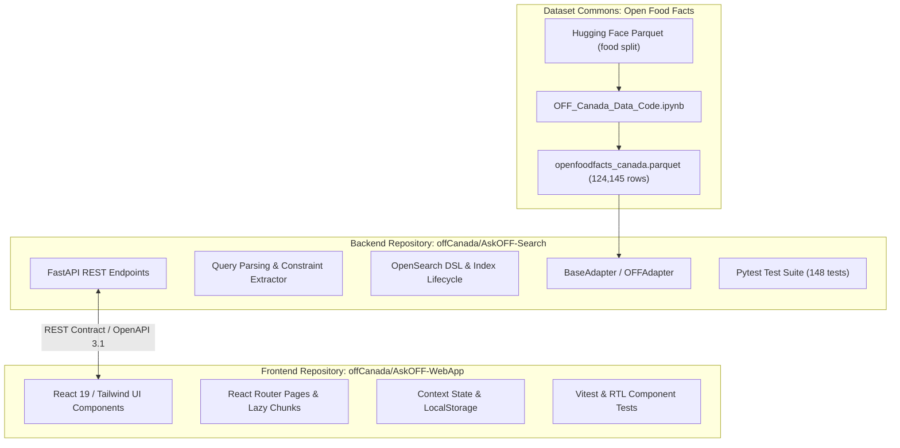

# Open Source Architecture & Contributor Guide — AskOFF Canada

This document outlines the open-source engineering standards, repository boundaries, contribution workflows, and extensibility patterns of the AskOFF project.

---

## 1. Modular Repository Architecture

To ensure clean contributor ownership and prevent monolithic coupling, AskOFF is architected as two decoupled repositories:



### Contributor Boundary Guidelines
- **Frontend Contributors** work exclusively in [`offCanada/AskOFF-WebApp`](https://github.com/offCanada/AskOFF-WebApp). They focus on user interaction, accessible UI components, animations, local state, and browser compatibility.
- **Backend & Search Contributors** work in [`offCanada/AskOFF-Search`](https://github.com/offCanada/AskOFF-Search). They focus on query parsing, constraint extraction, synonym rules, OpenSearch indexing, scoring, and performance.
- **Dataset Contributors** maintain extraction scripts, schema mappings, and data validation rules in `OFF_Canada_Data_Code.ipynb` and dataset repositories.

---

## 2. Platform Extensibility Patterns

AskOFF was engineered from the start to allow future contributors to extend functionality without modifying core retrieval algorithms.

### Pattern 1: Ingesting New Catalogs via `BaseAdapter`
To add a new country catalog or retailer feed (e.g., UK Open Food Facts or a regional grocery inventory), create a subclass of `BaseAdapter` in `backend/adapters/`:

```python
from backend.adapters.base import BaseAdapter
from backend.models.raw_product import RawProduct
from typing import Iterator

class RegionalGroceryAdapter(BaseAdapter):
    """Streams and maps regional food products into canonical RawProduct models."""
    
    def __init__(self, file_path: str):
        self.file_path = file_path

    def stream_products(self) -> Iterator[RawProduct]:
        # Implement streaming cursor (e.g. via DuckDB or JSON lines)
        for raw_record in self._read_records():
            yield RawProduct(
                id=str(raw_record["upc"]),
                name=raw_record["title"],
                brand=raw_record.get("brand"),
                nutriments=self._normalize_nutrients(raw_record),
                raw_data=raw_record
            )
```
The ingestion orchestrator (`backend/pipeline/`) automatically feeds these products to `SearchDocumentBuilder`, applying identical dietary flag computation, text cleaning, and OpenSearch bulk indexing.

### Pattern 2: Adding Canadian French/English Synonyms
Canadian grocery queries often feature bilingual variants (e.g., `soya sauce` vs. `soy sauce`, `lait d'amande` vs. `almond milk`). Contributors can expand synonym coverage by editing `backend/search/synonyms_ca.py`:

```python
CANADIAN_SYNONYMS = {
    "soya": "soy",
    "yogourt": "yogurt",
    "yoghurt": "yogurt",
    "kraft dinner": "macaroni and cheese",
    "lait de soya": "soy milk",
}
```
Synonym updates take effect immediately without requiring re-indexing.

### Pattern 3: Adding New Dietary & Nutritional Constraints
To support new nutritional constraints (e.g., "keto", "low carb", "high fiber"):
1. Update `backend/builders/search_document_builder.py` to precompute the boolean flag during ingestion:
   ```python
   is_high_fiber = per_100g("fiber") >= 6.0
   ```
2. Update `backend/query/constraint_extractor.py` to recognize conversational phrases:
   ```python
   if "high fiber" in query_text:
       filters["is_high_fiber"] = True
       clean_query = remove_tokens(clean_query, ["high", "fiber"])
   ```
3. Update `backend/search/mappings.py` to ensure the flag is mapped as a `boolean` field.

---

## 3. Contributor Setup & Verification

Both repositories enforce automated verification before pull requests are accepted.

### Backend Setup & Verification
```bash
git clone https://github.com/offCanada/AskOFF-Search.git
cd AskOFF-Search

# Set up Python virtual environment (Python 3.11 recommended)
python3.11 -m venv .venv
source .venv/bin/activate  # On Windows: .venv\Scripts\activate

# Install locked dependencies
pip install -r backend/requirements.txt
pip install pytest ruff

# Run full test suite
pytest backend/tests/

# Run static analysis (0 lint errors required)
ruff check backend/
```

> [!IMPORTANT]
> **Fresh-Clone Test Suite Reality**:
> In the verified development environment where the dataset artifact is present, all **148 tests pass** cleanly.
> 
> However, on a completely fresh clone where `data/raw/normalized.parquet` has not yet been obtained or generated, running `pytest backend/tests/` results in **143 passed / 5 failed** tests. Five retrieval/pipeline tests depend on reading the Parquet file from disk.
> 
> An open engineering task is to decouple these data-dependent tests using synthetic test fixtures so that the unit test suite passes 100% on clean clones without external dataset dependencies.

### Local Search Stack & Docker Volume Requirement
If running the search stack locally for contributor testing:
```bash
# Workaround for clean machines: pre-create the expected external volume
docker volume create ask-off-webapp_askoff-os-data

# Start OpenSearch
docker compose up -d opensearch
```
> [!NOTE]
> Before index bootstrap, a compatible normalized Parquet dataset must be made available at `data/raw/normalized.parquet` or `data/raw/off_canada_with_images.parquet` as detailed in [docs/data-engineering.md](data-engineering.md).

### Frontend Setup & Verification
```bash
git clone https://github.com/offCanada/AskOFF-WebApp.git
cd AskOFF-WebApp

# Install dependencies
npm install

# Run static linter
npm run lint

# Run typecheck
npx tsc -b

# Run component and unit test suite (24 passing tests required)
npm run test

# Verify production bundling
npm run build
```

---

## 4. Official Project Resources

| Resource | Link |
|---|---|
| Initial P3 prototype | https://github.com/offCanada/OFF-Canada-P3-Prototype |
| Backend / Search | https://github.com/offCanada/AskOFF-Search |
| Frontend / Web App | https://github.com/offCanada/AskOFF-WebApp |
| Kaggle dataset | https://www.kaggle.com/datasets/saitejakommi/open-food-facts-canada-dataset |
| Hugging Face dataset | https://huggingface.co/datasets/offCanada/openfoodfacts-canada |
| Dataset generation notebook | https://huggingface.co/datasets/offCanada/openfoodfacts-canada/blob/main/OFF_Canada_Data_Code.ipynb |

---

## 5. Licensing & Provenance Distinction

Licensing boundaries across dataset commons and software repositories are strictly differentiated:

- **Open Food Facts Data Commons**: All underlying product data is derived from Open Food Facts and is licensed under the **Open Database License (ODbL)**. Derivative data products must attribute Open Food Facts contributors and provide data back to the commons under compatible terms.
- **Backend Software License**: [`offCanada/AskOFF-Search`](https://github.com/offCanada/AskOFF-Search) is released under the **Apache License 2.0** (verified in repository `LICENSE`).
- **Frontend Software License**: [`offCanada/AskOFF-WebApp`](https://github.com/offCanada/AskOFF-WebApp) is a public repository on GitHub, but currently does not contain an explicit committed LICENSE file in its repository root. Therefore, no formal software license is asserted.
- **Product Images**: Product photographs are crowd-sourced and remain the intellectual property of their uploaders under Open Food Facts Creative Commons licenses (CC-BY-SA).
